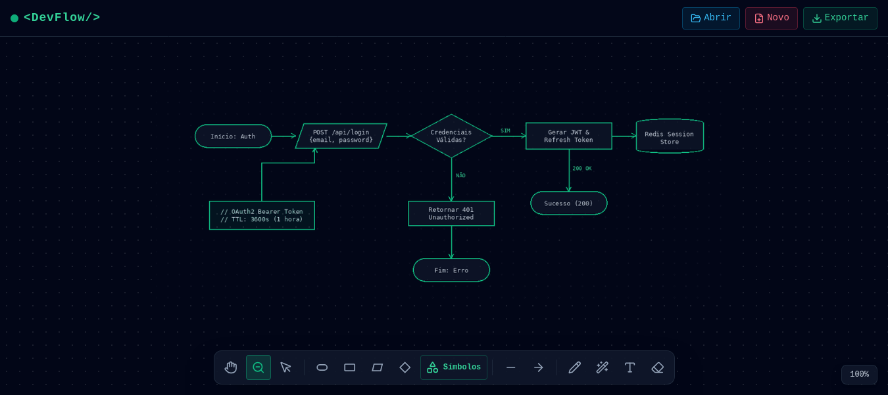
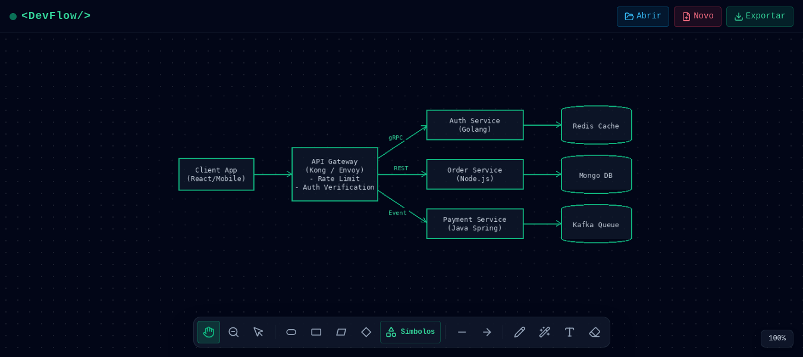
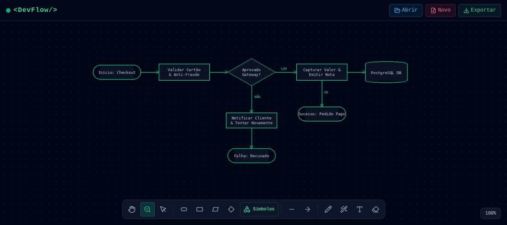
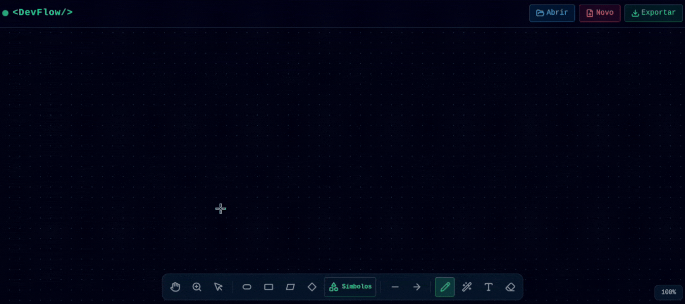
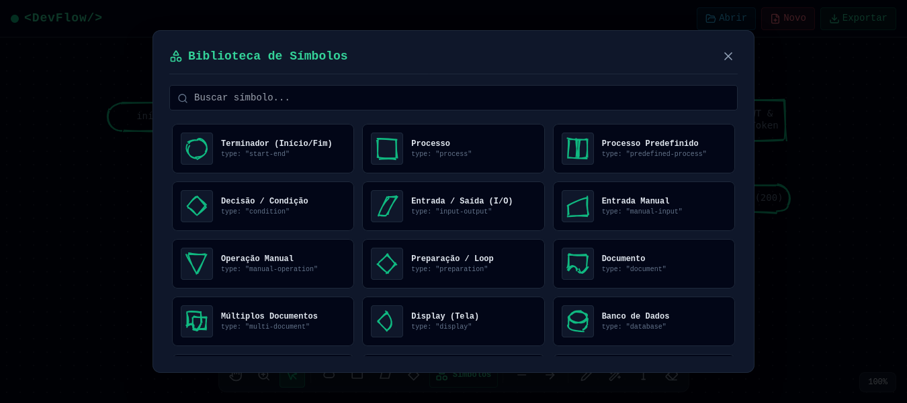
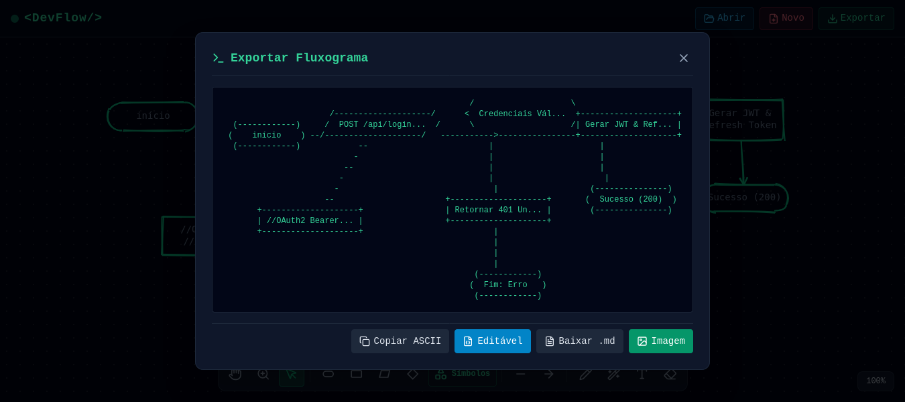

# ⚡ DevFlow - Algorithmic Flowchart Editor

<p align="center">
  
  
  
  
</p>

> **DevFlow** é uma ferramenta web interativa (!criada com IA), leve e moderna, projetada especificamente para desenvolvedores, estudantes e engenheiros de software desenharem e documentarem fluxogramas de algoritmos rapidamente, trazendo uma interface limpa com estética *dark mode* focada na produtividade.

## ✨ Funcionalidades Principais

* **🎨 Estética Visual Exclusiva:** Traço vetorial estilo *hand-drawn* (desenho à mão) para tornar os diagramas mais orgânicos e menos engessados.
* **⚡ Reconhecimento Inteligente de Formas:** Rabisque livremente na tela e a inteligência do app ajusta automaticamente o traço para o símbolo geométrico correto (pílula, losango, paralelogramo, etc.).
* **✏️ Caneta Livre Suavizada:** Desenhe formas customizadas ou traços livres com suavização automática (`Chaikin's Corner Cutting`) e suporte completo a edição, texto e redimensionamento.
* **🧲 Conectores Magnéticos Dinâmicos (Smart Anchoring):** Conecte formas com linhas e setas que calculam matematicamente a interseção nas bordas e acompanham o movimento dos elementos de forma contínua.
* **📚 Biblioteca de Símbolos Completa:** Acesso a 52 símbolos da convenção padrão de fluxogramas e arquitetura (Banco de dados, subprocessos, telas, cartões perfurados, etc.) com sistema de busca rápida.
* **🔤 Edição Dinâmica de Texto:** Crie ou clique em qualquer forma e comece a digitar. A forma calcula a largura e altura do texto e se expande dinamicamente para acomodar o conteúdo.
* **💻 Exportação ASCII Art em Matriz 2D:** Converta seu diagrama gráfico em um arquivo de texto ASCII preservando o posicionamento espacial exato das formas. Perfeito para colar direto no código, *docstrings* ou arquivos de documentação markdown!
* **💾 Projetos Editáveis (`.devflow`):** Salve e abra seus projetos a qualquer momento com integração direta ao sistema operacional nativo (`FileSystemAccess API`).
* **🔄 Undo/Redo & Auto-Save:** Controle total com histórico de ações (`Ctrl + Z`, `Ctrl + Y`), atalhos de teclado produtivos e salvamento automático local.

## 🛠️ Tecnologias Utilizadas

* **HTML5 Canvas API** — Renderização gráfica de alta performance.
* **JavaScript (ES6+)** — Motor lógico 100% *client-side*, garantindo privacidade e zero dependência de servidores.
* **Rough.js** — Renderizador base para os traços e curvas.
* **Tailwind CSS** — Construção de interface moderna, componentizada e responsiva.
* **Lucide Icons** — Iconografia SVG otimizada.
* **HTML2Canvas** — Geração de snapshots para exportação de imagem.

## 📸 Demonstração Visual

### 📌 1. Fluxogramas de Sistemas em Ação

| 1 | 2 | 3 |
| :---: | :---: | :---: |
|  |  |  |
---

### 🛠️ 2. Ferramentas Principais

| **⚡ Reconhecimento Inteligente (Smart Draw) & Caneta Livre**| **📚 Biblioteca de Símbolos ISO com Preview Vetorial em Tempo Real** |
| :---: | :---: |
| Rabisque qualquer forma à mão na tela e a inteligência do editor converte automaticamente para a forma geométrica ISO correspondente, mantendo o traço *hand-drawn*.  | Acesso a mais de 30 símbolos da norma ISO para algoritmos e arquitetura de dados, com campo de busca rápida e mini-canvas de pré-visualização.  |

---

#### 🧲 Conectores Magnéticos Dobráveis & Edição com Alinhamento de Texto
Setas inteligentes que calculam automaticamente a borda das formas e permitem criar novos vértices (dobras) apenas clicando e arrastando. Além disso, conta com minibar de formatação de texto (Esquerda, Centro, Direita).


---

### 📤 3. Central de Exportação

Possibilidades de exportação: em *ASCII*, *Image* e *Arquivo editável*.


## ⌨️ Atalhos de Teclado

| Atalho | Ação |
| :--- | :--- |
| <kbd>H</kbd> | Ferramenta Mão / Mover tela (Pan) |
| <kbd>S</kbd> | Ferramenta Selecionar / Redimensionar |
| <kbd>P</kbd> | Caneta Livre (Pencil) |
| <kbd>W</kbd> | Auto-Ajuste de Formas (Smart Draw) |
| <kbd>T</kbd> | Texto Livre |
| <kbd>E</kbd> | Borracha |
| <kbd>Ctrl</kbd> + <kbd>Z</kbd> | Desfazer (Undo) |
| <kbd>Ctrl</kbd> + <kbd>Y</kbd> ou <kbd>Shift</kbd> + <kbd>Ctrl</kbd> + <kbd>Z</kbd> | Refazer (Redo) |
| <kbd>Delete</kbd> ou <kbd>Backspace</kbd> | Excluir elemento selecionado |
| <kbd>Enter</kbd> (no editor) | Salvar texto e fechar edição |
| <kbd>Shift</kbd> + <kbd>Enter</kbd> | Quebrar linha dentro do texto |

## 🚀 Como Executar o Projeto

Como o DevFlow não possui backend, a instalação é instantânea. Não é necessário Node.js ou ferramentas de build complexas.

1. Clone este repositório:
   ```bash
   git clone [https://github.com/f4boco/devflow.git](https://github.com/f4boco/devflow.git)
2. Acesse a pasta do projeto:
    ```bash
    cd devflow
    ```
3. Abra o arquivo `index.html` em qualquer navegador web moderno e comece a diagramar!

## 📄 Licença

Este projeto está sob a licença **MIT**. Veja o arquivo [LICENSE](LICENSE) para mais detalhes.

## 👨‍💻 Autor

Desenvolvido por **Fabiano O.**

GitHub: https://github.com/f4boco